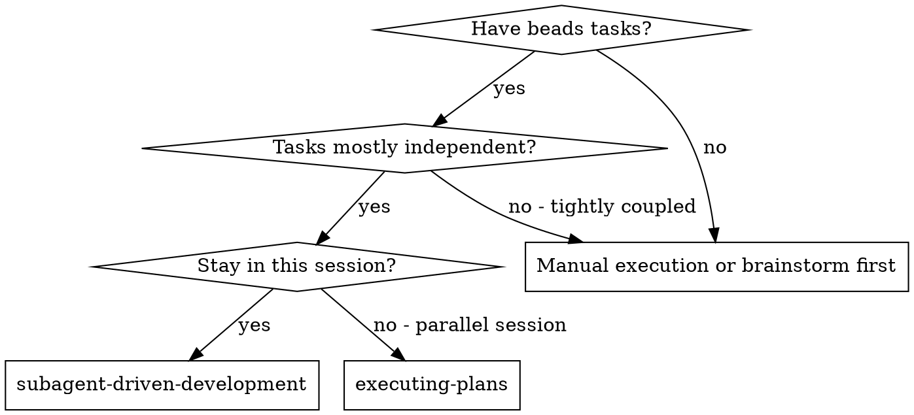
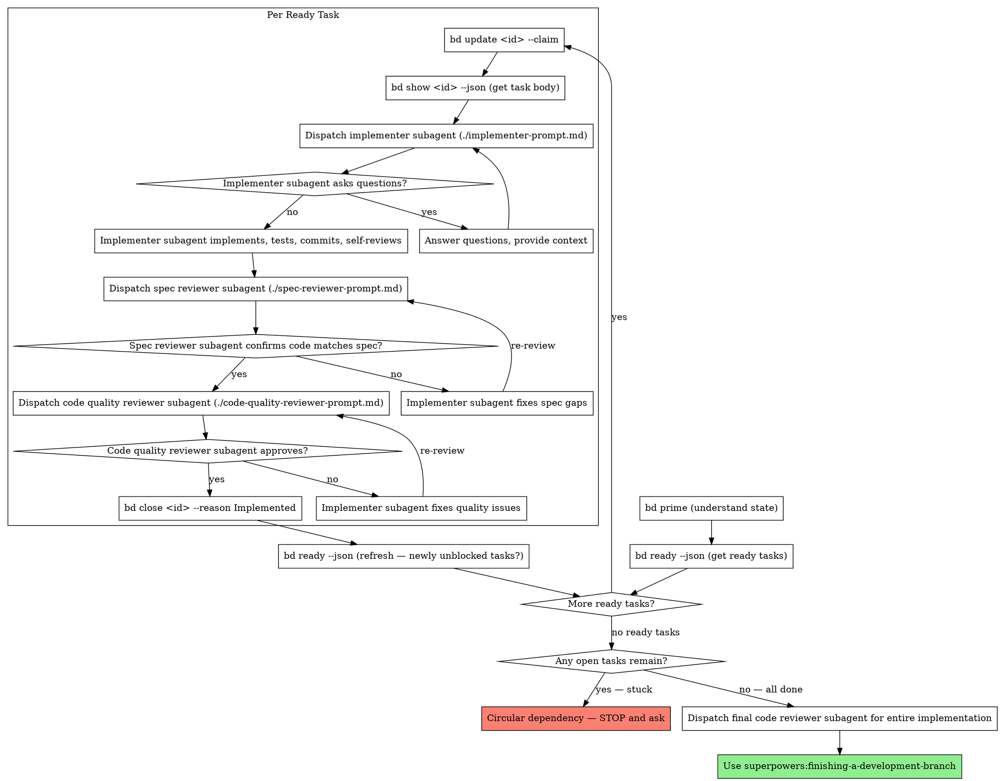

# Subagent-Driven Development

Execute beads tasks by dispatching fresh subagent per task, with two-stage review after each: spec compliance review first, then code quality review. Tasks are driven by `bd ready` — the dependency graph determines execution order.

**Core principle:** `bd ready` → claim → fresh subagent → two-stage review → close → repeat

## When to Use



**vs. Executing Plans (parallel session):**
- Same session (no context switch)
- Fresh subagent per task (no context pollution)
- Two-stage review after each task: spec compliance first, then code quality
- Faster iteration (no human-in-loop between tasks)

**Prerequisites:**
- **REQUIRED SUB-SKILL:** superpowers:using-beads
- Beads initialized with tasks (created by writing-plans skill)
- `bd` CLI available

## The Process



## Prompt Templates

- `./implementer-prompt.md` - Dispatch implementer subagent
- `./spec-reviewer-prompt.md` - Dispatch spec compliance reviewer subagent
- `./code-quality-reviewer-prompt.md` - Dispatch code quality reviewer subagent

## Example Workflow

```
You: I'm using Subagent-Driven Development to execute tasks from the beads dependency graph.

[Run bd prime to understand project state]
[Run bd ready --json — returns 3 ready tasks: bd-a1b2, bd-c3d4, bd-e5f6]
[Create TodoWrite with ready tasks]

Task bd-a1b2: Hook installation script

[bd update bd-a1b2 --claim]
[bd show bd-a1b2 --json — get full task body]
[Dispatch implementation subagent with task body + context]

Implementer: "Before I begin - should the hook be installed at user or system level?"

You: "User level (~/.config/superpowers/hooks/)"

Implementer: "Got it. Implementing now..."
[Later] Implementer:
  - Implemented install-hook command
  - Added tests, 5/5 passing
  - Self-review: Found I missed --force flag, added it
  - Committed

[Dispatch spec compliance reviewer]
Spec reviewer: PASS — Spec compliant - all requirements met, nothing extra

[Get git SHAs, dispatch code quality reviewer]
Code reviewer: Strengths: Good test coverage, clean. Issues: None. Approved.

[bd close bd-a1b2 --reason "Implemented and tested"]
[bd ready --json — bd-g7h8 is now unblocked (was blocked by bd-a1b2)!]
[Update TodoWrite: bd-a1b2 complete, add bd-g7h8 as new ready task]

Task bd-c3d4: Recovery modes

[bd update bd-c3d4 --claim]
[bd show bd-c3d4 --json]
[Dispatch implementation subagent with task body + context]

Implementer: [No questions, proceeds]
Implementer:
  - Added verify/repair modes
  - 8/8 tests passing
  - Self-review: All good
  - Committed

[Dispatch spec compliance reviewer]
Spec reviewer: FAIL — Issues:
  - Missing: Progress reporting (spec says "report every 100 items")
  - Extra: Added --json flag (not requested)

[Implementer fixes issues]
Implementer: Removed --json flag, added progress reporting

[Spec reviewer reviews again]
Spec reviewer: PASS — Spec compliant now

[Dispatch code quality reviewer]
Code reviewer: Strengths: Solid. Issues (Important): Magic number (100)

[Implementer fixes]
Implementer: Extracted PROGRESS_INTERVAL constant

[Code reviewer reviews again]
Code reviewer: PASS — Approved

[bd close bd-c3d4 --reason "Implemented and tested"]
[bd ready --json — check for newly unblocked tasks]

...

[After all tasks: bd list --json --status open returns empty]
[Dispatch final code-reviewer]
Final reviewer: All requirements met, ready to merge

Done!
```

## Advantages

**vs. Manual execution:**
- Subagents follow TDD naturally
- Fresh context per task (no confusion)
- Parallel-safe (subagents don't interfere)
- Subagent can ask questions (before AND during work)
- Beads tracks state persistently across sessions

**vs. Executing Plans:**
- Same session (no handoff)
- Continuous progress (no waiting)
- Review checkpoints automatic

**Beads-driven benefits:**
- `bd ready` ensures correct task ordering by dependency graph
- Closing a task automatically unblocks downstream tasks
- Task state persists across sessions (crash recovery)
- `bd prime` provides context for new sessions continuing previous work
- No need to pre-extract all tasks — query beads dynamically

**Efficiency gains:**
- No file reading overhead (controller queries beads for task body)
- Controller provides exactly the right context per subagent
- Subagent gets complete information upfront
- Questions surfaced before work begins (not after)

**Quality gates:**
- Self-review catches issues before handoff
- Two-stage review: spec compliance, then code quality
- Review loops ensure fixes actually work
- Spec compliance prevents over/under-building
- Code quality ensures implementation is well-built

**Cost:**
- More subagent invocations (implementer + 2 reviewers per task)
- Controller does more prep work (querying beads, providing context)
- Review loops add iterations
- But catches issues early (cheaper than debugging later)

## Red Flags

**Never:**
- Start implementation on main/master branch without explicit user consent
- Skip reviews (spec compliance OR code quality)
- Proceed with unfixed issues
- Dispatch multiple implementation subagents in parallel (conflicts)
- Make subagent query beads directly (provide task body instead)
- Skip scene-setting context (subagent needs to understand where task fits)
- Ignore subagent questions (answer before letting them proceed)
- Accept "close enough" on spec compliance (spec reviewer found issues = not done)
- Skip review loops (reviewer found issues = implementer fixes = review again)
- Let implementer self-review replace actual review (both are needed)
- **Start code quality review before spec compliance is PASS** (wrong order)
- Move to next task while either review has open issues
- Forget to `bd close` after task passes all reviews

**If subagent asks questions:**
- Answer clearly and completely
- Provide additional context if needed
- Don't rush them into implementation

**If reviewer finds issues:**
- Implementer (same subagent) fixes them
- Reviewer reviews again
- Repeat until approved
- Don't skip the re-review

**If subagent fails task:**
- Dispatch fix subagent with specific instructions
- Don't try to fix manually (context pollution)

## Integration

**Required workflow skills:**
- **superpowers:using-beads** - REQUIRED: Task management via beads
- **superpowers:using-git-worktrees** - REQUIRED: Set up isolated workspace before starting
- **superpowers:writing-plans** - Creates the beads dependency graph this skill executes
- **superpowers:requesting-code-review** - Code review template for reviewer subagents
- **superpowers:finishing-a-development-branch** - Complete development after all tasks

**Subagents should use:**
- **superpowers:test-driven-development** - Subagents follow TDD for each task

**Alternative workflow:**
- **superpowers:executing-plans** - Use for parallel session instead of same-session execution
